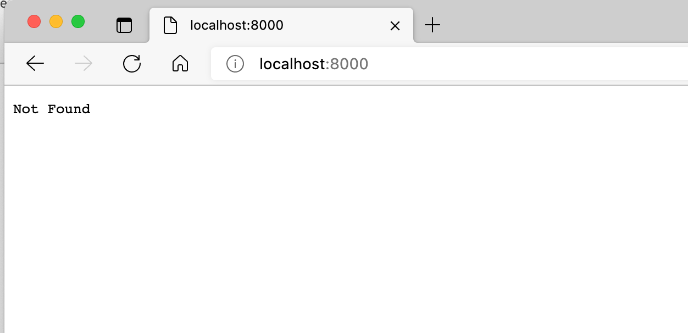
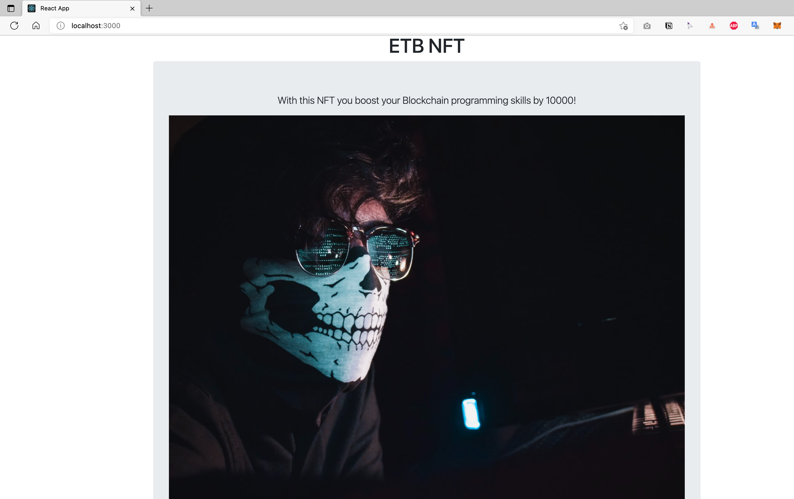

# Create NFT Tutorials

## Prerequisites 
* npm 
> [install nodejs](https://nodejs.org/en/download/)
* sol  
> execue command: `sudo npm install -g solc@0.8.12`
* truffle 
> execue command: `sudo npm install -g truffle@5.5.3`

* truffle/hdwallet-provider 
> execue command: `sudo npm install @truffle/hdwallet-provider@1.7.0`

## Frontend Part
### Execute Setps

* modify token.json
```
{
  "0": {
    "name": "ETB NFT",
    "description": "With this NFT you boost your Blockchain programming skills by 10000!",
    "image": "http://localhost:8000/token-0.jpeg"
  }
}
```
> image url setting local url .
> setting server port 8000 on server.js `app.listen(process.env.PORT || 8000);`
* build project 
```
npm install
```
* Run Project
```
npm start
```
* Test 
browser http://localhost:8000 url on explorer



## SmartContract Part 
### Execute Setps

* Register infura account 

https://infura.io/ 

* Create project copy enpoints url


* Create eth test private key by MateMask

* Get rinkeby Faucet

https://faucets.chain.link/rinkeby

* setting truffle-config.js 
> setting mnemonic(test private key) and rinkeby mnemonic (infura project enpoints https url)

* modify NFT smart contract 

```
  function _baseURI() internal view override returns (string memory) {
    return 'http://localhost:8000/';
  }

```
_baseURI() to return local server url.

* Build Project

> npm install
> truffle compile

* Deploy SmartContract 
> truffle migrate --reset --network rinkeby

### Output logs 

```

Compiling your contracts...
===========================
> Everything is up to date, there is nothing to compile.


Starting migrations...
======================
> Network name:    'rinkeby'
> Network id:      4
> Block gas limit: 29999972 (0x1c9c364)


1_initial_migration.js
======================

   Replacing 'Migrations'
   ----------------------
   > transaction hash:    0x46cf11e40f82c93534ce8bca142eb04af248060ff8dcb4ca81039104e8958687
   > Blocks: 2            Seconds: 22
   > contract address:    0xC716bbb861E7D40EDf6f7D276f24742Bcd17eFb7
   > block number:        10297289
   > block timestamp:     1646808573
   > account:             0xe4b2c5217EE1F4e6f5FF51F11396318530FE5F77
   > balance:             1.574698174800225781
   > gas used:            245600 (0x3bf60)
   > gas price:           2.500000014 gwei
   > value sent:          0 ETH
   > total cost:          0.0006140000034384 ETH

   > Saving migration to chain.
   > Saving artifacts
   -------------------------------------
   > Total cost:     0.0006140000034384 ETH


2_deploy_contracts.js
=====================

   Replacing 'NFT'
   ---------------
   > transaction hash:    0xa2dd1f54534c8f27a12ad39f2a97ee0cc7d7b2976d44913821f9a0c35e3de6fc
   > Blocks: 2            Seconds: 22
   > contract address:    0x85bBb7040AA64B30F856b981068c12Afc632d128
   > block number:        10297293
   > block timestamp:     1646808633
   > account:             0xe4b2c5217EE1F4e6f5FF51F11396318530FE5F77
   > balance:             1.568783004767100829
   > gas used:            2320155 (0x23671b)
   > gas price:           2.500000014 gwei
   > value sent:          0 ETH
   > total cost:          0.00580038753248217 ETH

   > Saving migration to chain.
   > Saving artifacts
   -------------------------------------
   > Total cost:     0.00580038753248217 ETH

Summary
=======
> Total deployments:   2
> Final cost:          0.00641438753592057 ETH

```

## Backend Part

### Execute Setps

* modify App.js
```
  useEffect(() => {
    const init = async () => {
      const { nft } = await getBlockchain();
      const tokenId = await nft.nextTokenId();
      const tokenURI = await nft.tokenURI(tokenId-1);
      const { data } = await axios.get(tokenURI);
      console.log(`data:${data}`);
      setTokenInfo(data.result);
    };
    init();
  }, []);
```  
Need get `nft.nextTokenId()` then create tokenUrl,tokenId need `tokenId-1` that on NFT smart contract create token will be add 1.

* Build Project
> npm install

* Run Project
> npm start 

* Page Test
> 1. need to connect matemask 
> 2. get token image



## Link

https://www.youtube.com/watch?v=WsZyb2T83lo

