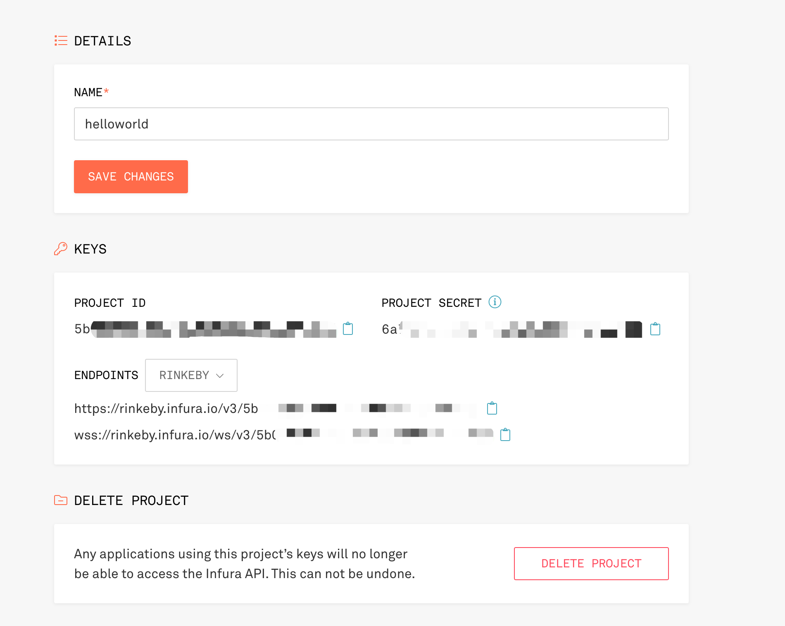

# Create NFT Tutorials

## Prerequisites 
* npm 
> [install nodejs](https://nodejs.org/en/download/)
* sol  
> execue command: `sudo npm install -g solc@0.8.12`
* truffle 
> execue command: `sudo npm install -g truffle@5.5.3`

* truffle/hdwallet-provider 
> execue command: `sudo npm install @truffle/hdwallet-provider@1.7.0`

## Execute Setps

* Register infura account 

https://infura.io/ 

* Create project copy enpoints url



* Create eth test private key by MateMask

* Get rinkeby Faucet

https://faucets.chain.link/rinkeby

* setting truffle-config.js 
> setting mnemonic(test private key) and rinkeby mnemonic (infura project enpoints https url)

* Build Project

> npm install
> truffle compile

* Deploy SmartContract 
> truffle migrate --reset --network rinkeby

## Output logs 

```

Compiling your contracts...
===========================
> Everything is up to date, there is nothing to compile.


Starting migrations...
======================
> Network name:    'rinkeby'
> Network id:      4
> Block gas limit: 29999943 (0x1c9c347)


1_initial_migration.js
======================

   Replacing 'Migrations'
   ----------------------
   > transaction hash:    0x7c5c695373e71f88befb507b1e5c4746bc8c0e1fb63dae64856f162089701179
   > Blocks: 1            Seconds: 19
   > contract address:    0xe72eC364714A9acF745C3c1ED9774e336d13110c
   > block number:        10295981
   > block timestamp:     1646788768
   > account:             0xe4b2c5217EE1F4e6f5FF51F11396318530FE5F77
   > balance:             0.290613672376696938
   > gas used:            245600 (0x3bf60)
   > gas price:           2.500000012 gwei
   > value sent:          0 ETH
   > total cost:          0.0006140000029472 ETH

   > Saving migration to chain.
   > Saving artifacts
   -------------------------------------
   > Total cost:     0.0006140000029472 ETH


2_deploy_contracts.js
=====================

   Replacing 'NFT'
   ---------------
   > transaction hash:    0x708b22fbd75545ef5310ab55ed542d50a6a852b5798bad912a2b8eb8e12bf9fb
   > Blocks: 2            Seconds: 22
   > contract address:    0x5Af8a188231a4363e53de2f9ecCF20037BB3A8fE
   > block number:        10295985
   > block timestamp:     1646788828
   > account:             0xe4b2c5217EE1F4e6f5FF51F11396318530FE5F77
   > balance:             0.284718832348401706
   > gas used:            2312023 (0x234757)
   > gas price:           2.500000012 gwei
   > value sent:          0 ETH
   > total cost:          0.005780057527744276 ETH

   > Saving migration to chain.
   > Saving artifacts
   -------------------------------------
   > Total cost:     0.005780057527744276 ETH

Summary
=======
> Total deployments:   2
> Final cost:          0.006394057530691476 ETH
```

## Link

https://www.youtube.com/watch?v=WsZyb2T83lo

